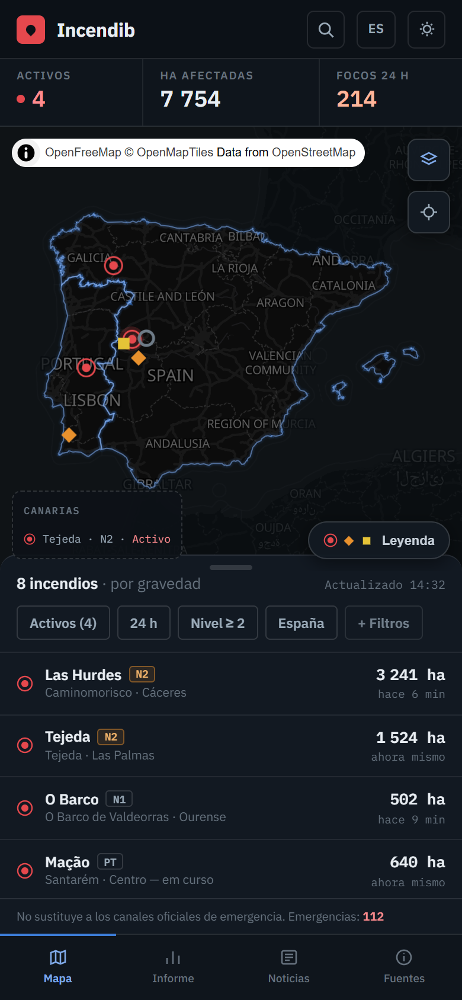
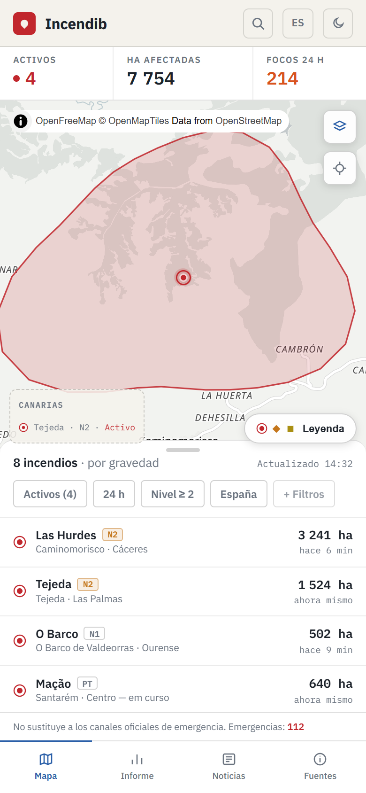
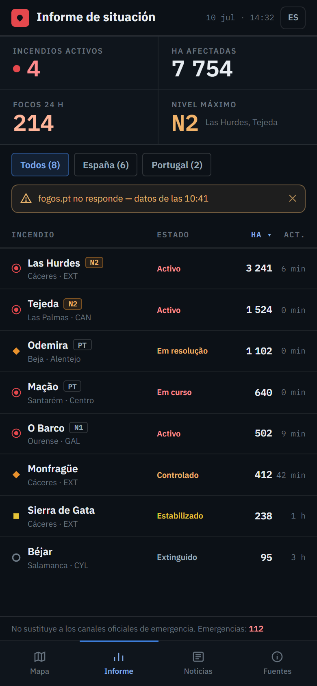
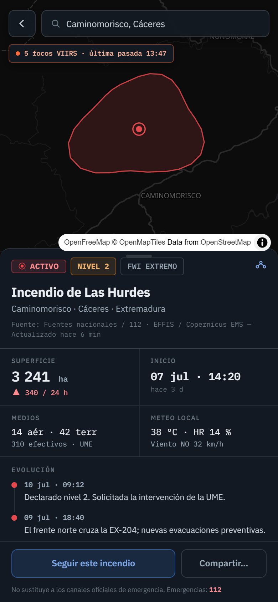
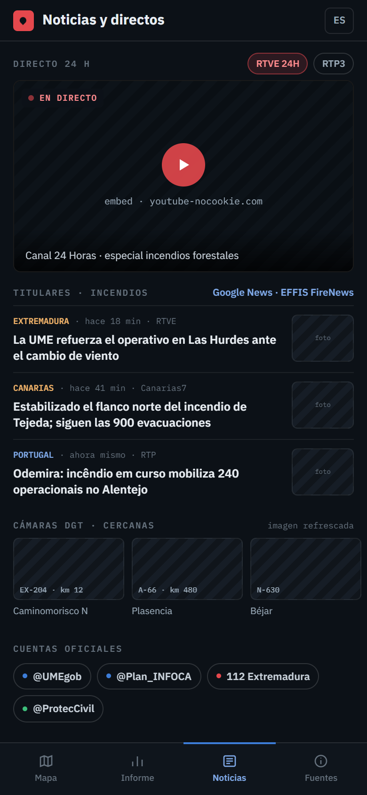
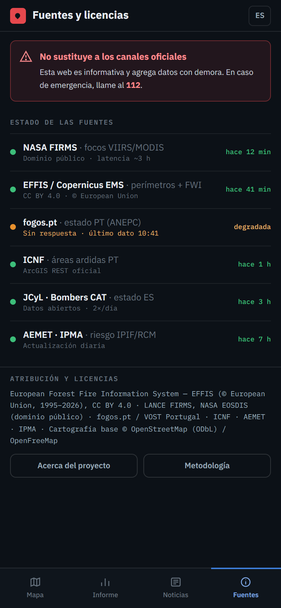

<div align="center">

# 🔥 Incendib

**Visor en tiempo real de incendios forestales activos en España y Portugal**

Herramienta pública y sin ánimo de lucro que agrega datos oficiales de focos
satelitales, perímetros de área quemada y estado operativo en un mapa claro,
serio y usable — pensada como panel de sala de emergencias, no como landing.

[](https://nextjs.org)
[](https://www.typescriptlang.org)
[](https://maplibre.org)


</div>

> [!WARNING]
> **Incendib no es un canal oficial de emergencias.** Los datos pueden tener
> latencia y las detecciones satelitales no equivalen a incendios confirmados.
> Ante peligro inmediato, llama al **112**.

---

## Vista previa

| Modo oscuro (por defecto, "sala de control") | Modo claro (exteriores) |
| :---: | :---: |
|  |  |

### Pantallas

| Informe | Ficha de incendio | Noticias | Fuentes |
| :---: | :---: | :---: | :---: |
|  |  |  |  |

## Qué es

Incendib es una **web app mobile-first** (PWA, no requiere tienda de apps) que
reúne información de incendios de la Península Ibérica, Canarias, Baleares,
Azores, Madeira, Ceuta y Melilla. Combina tres capas de precisión creciente:

1. **Focos satelitales** casi en tiempo real (NASA FIRMS · VIIRS/MODIS).
2. **Perímetros de área quemada y riesgo meteorológico** (EFFIS / Copernicus EMS).
3. **Estado operativo y nivel de gravedad** de fuentes nacionales y autonómicas
   (fogos.pt/ICNF en Portugal; JCyL y Bombers de Catalunya en España).

## Características

- 🗺️ **Mapa en vivo** (MapLibre GL) con el resto del mundo atenuado y España +
  Portugal resaltados con un halo sutil.
- 🎨 **Marcadores por color _y_ forma** (activo, controlado, estabilizado,
  extinguido, foco satelital) — accesible para daltonismo, nunca solo color.
- 📊 **Panel de situación**: KPIs (activos, hectáreas, focos 24 h), lista por
  gravedad y filtros rápidos.
- 🌗 **Tema oscuro por defecto** y claro para exteriores, con persistencia.
- 🌐 **Trilingüe** ES · PT · EN; el dato bilingüe (estados PT «em curso»…) se
  conserva en su idioma original.
- ♿ **Accesibilidad WCAG 2.2 AA**: foco visible, `prefers-reduced-motion`,
  nombres accesibles completos en marcadores y filas.
- 🔗 **Ficha por incendio** con URL propia y compartible (`/f/{slug}`) e imagen
  Open Graph generada en servidor.
- 📶 **Resiliencia**: la caída de una fuente se señaliza por capa, nunca rompe
  el mapa; caché offline con antigüedad visible.

## Stack técnico

| Área | Tecnología |
| --- | --- |
| Framework | Next.js 15 (App Router) · React 19 · TypeScript |
| Estilos | Tailwind CSS con tokens sobre variables CSS (theming en runtime) |
| Mapa | MapLibre GL JS vía `react-map-gl` · teselas OpenFreeMap (sin API key) |
| Estado | Zustand |
| PWA | Service Worker propio (offline + Web Push) |
| Tipografía | IBM Plex Sans (UI) + IBM Plex Mono (cifras) |

## Puesta en marcha

Requisitos: **Node.js ≥ 20**.

```bash
# 1. Instalar dependencias
npm install

# 2. (Opcional) configurar variables de entorno
cp .env.example .env.local     # arranca en modo mock sin ninguna clave

# 3. Desarrollo
npm run dev                    # http://localhost:3000

# 4. Producción
npm run build && npm start
```

Sin claves, la app arranca en **modo demostración** (`NEXT_PUBLIC_DATA_MODE=mock`)
con un conjunto de incendios de ejemplo. Para datos reales, ver
[`docs/DATA-SOURCES.md`](docs/DATA-SOURCES.md).

### Scripts

| Script | Descripción |
| --- | --- |
| `npm run dev` | Servidor de desarrollo |
| `npm run build` | Build de producción |
| `npm start` | Servir el build |
| `npm run typecheck` | Comprobación de tipos (`tsc --noEmit`) |
| `npm run lint` | ESLint (config de Next) |
| `npm run geo:gen` | Regenera las geometrías del mapa (máscara ES+PT) |

## Estructura

```
src/
├── app/            # rutas (App Router): mapa, informe, noticias, fuentes, ficha, API
├── components/     # UI, mapa, layout, pantallas, i18n
├── lib/            # design tokens, datos, i18n, mapa, utilidades, store
└── types/          # modelo de dominio (Fire, Hotspot…)
public/geo/         # geometrías estáticas (máscara del mundo, contorno ES+PT)
docs/               # arquitectura, fuentes de datos, handoff de diseño, capturas
```

Detalle completo en [`docs/ARCHITECTURE.md`](docs/ARCHITECTURE.md).

## Fuentes de datos y licencias

Todas las fuentes son de reutilización libre con atribución:

- **EFFIS / Copernicus EMS** — perímetros y FWI · © European Union (CC BY 4.0).
- **NASA FIRMS** (VIIRS/MODIS) — focos térmicos · dominio público.
- **fogos.pt / ANEPC**, **ICNF** — estado operativo en Portugal.
- **AEMET / IPMA** — meteorología y riesgo de incendio.
- **JCyL**, **Bombers de la Generalitat** — datos autonómicos abiertos.
- Cartografía base © **OpenStreetMap** (ODbL) vía **OpenFreeMap**.

## Hoja de ruta

- [x] **v0.1** — Estructura, sistema de diseño, PWA, i18n, capa de datos.
- [x] **v0.2** — Pantalla **Mapa** (home) con MapLibre, máscara, marcadores, filtros
  y perímetros de área quemada (EFFIS).
- [x] **v0.3** — Pantallas **Informe**, **Fuentes**, **Ficha** y **Noticias**;
  estados de red (offline/reconexión), error y carga (skeleton).
- [x] **v0.4** — **Panel desktop** (1d): filtros, mapa y lista en tres columnas.
- [ ] **v0.5** — Fuentes de datos en vivo (FIRMS/EFFIS/fogos.pt) con caché en backend.
- [ ] **v0.6** — Web Push (alertas por zona) e histórico de campaña.

## Licencia

© 2026 David Moreno Romero. Todos los derechos reservados.
